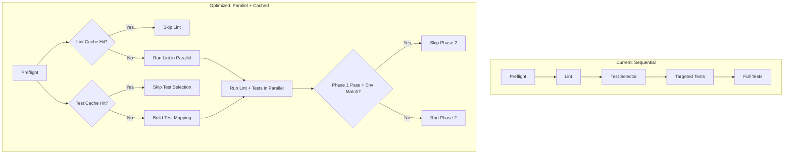

# Validation Pipeline Optimization Implementation Plan

## Overview

This plan outlines the implementation of validation pipeline optimizations to achieve 50-70% reduction in validation time for typical patches.

## Architecture



## Files to Modify

| File | Changes |
|------|---------|
| `third_party/code-agent-runtime/apps/validation_worker.py` | Parallel execution orchestration |
| `third_party/code-agent-runtime/runtime/validation/lint_runner.py` | Add caching layer |
| `third_party/code-agent-runtime/runtime/validation/test_selector.py` | Add caching layer |
| `third_party/code-agent-runtime/runtime/validation/full_tests.py` | Enhanced skip conditions |
| `third_party/code-agent-runtime/runtime/common/config.py` | Adaptive timeout support |
| `third_party/code-agent-runtime/runtime/validation/command_discovery.py` | Phase 2 short-circuit |

---

## Task 1: Implement Parallel Execution for Lint + Targeted Tests

### Modify `validation_worker.py`

Add parallel execution using `concurrent.futures.ThreadPoolExecutor`:

```python
# Current sequential execution (lines 60-63)
preflight = self.preflight.run(repo_root, patch)
lint_result = lint.run_for_language(repo_root, patch.changed_files, language)
selected_tests = self.selector.select(repo_root, patch.changed_files, plan.test_targets)
tests = tests_runner.run_for_language(repo_root, selected_tests, language)
```

### Implementation Steps

1. Pre-compute test selection before parallel execution
2. Execute lint and targeted tests in parallel using ThreadPoolExecutor
3. Aggregate results after both complete
4. Fall back to sequential if parallel fails

### Expected Impact
- Savings: 30-60s per validation
- Risk: Low (results are independent)

---

## Task 2: Implement Enhanced Full Test Skip Logic

### Modify `full_tests.py`

Current logic at line 66:
```python
if preflight.ok and lint_result.ok and tests.ok and len(patch.changed_files) <= 2:
```

### New Logic

```python
def should_run_full_tests(patch, preflight_ok, lint_ok, tests_ok) -> bool:
    if not (preflight_ok and lint_ok and tests_ok):
        return False
    
    # Skip if patch is low-risk
    if len(patch.changed_files) <= 2:
        # Check if any test files or core source files changed
        has_test_changes = any(f.endswith('_test.py') for f in patch.changed_files)
        has_core_changes = any(f.startswith('src/') for f in patch.changed_files)
        if not has_test_changes and not has_core_changes:
            return False
    
    # Skip docs-only, config-only, or refactoring-only changes
    low_risk_extensions = {'.md', '.txt', '.yaml', '.yml', '.json', '.toml'}
    if all(Path(f).suffix in low_risk_extensions for f in patch.changed_files):
        return False
    
    return True
```

### Expected Impact
- Savings: 60-300s per validation (skip unnecessary full test runs)
- Risk: Low (only skips when safe)

---

## Task 3: Implement Lint Result Caching

### Create `validation_cache.py`

```python
from pathlib import Path
import hashlib
import json

class ValidationCache:
    def __init__(self, cache_dir: Path):
        self.cache_dir = cache_dir / "validation"
        self.cache_dir.mkdir(parents=True, exist_ok=True)
    
    def _file_hash(self, filepath: Path) -> str:
        return hashlib.md5(filepath.read_bytes()).hexdigest()
    
    def _cache_key(self, repo_root: Path, changed_files: list[str], lang: str) -> str:
        hashes = sorted(self._file_hash(repo_root / f) for f in changed_files)
        return hashlib.md5("".join(hashes).encode()).hexdigest() + f"_{lang}"
    
    def get_lint(self, repo_root: Path, changed_files: list[str], lang: str) -> dict | None:
        key = self._cache_key(repo_root, changed_files, lang)
        cache_file = self.cache_dir / f"lint_{key}.json"
        if cache_file.exists():
            return json.loads(cache_file.read_text())
        return None
    
    def set_lint(self, repo_root: Path, changed_files: list[str], lang: str, result: dict):
        key = self._cache_key(repo_root, changed_files, lang)
        cache_file = self.cache_dir / f"lint_{key}.json"
        cache_file.write_text(json.dumps(result))
```

### Expected Impact
- Savings: 10-60s on re-validation of unchanged files
- Risk: Low (file hash validation ensures correctness)

---

## Task 4: Implement Test Selection Caching

### Modify `test_selector.py`

Add cache for file-to-test mapping:

```python
class CachedTestSelector(TestSelector):
    def __init__(self, *args, cache_dir: Path | None = None, **kwargs):
        super().__init__(*args, **kwargs)
        self._mapping_cache: dict[str, list[str]] = {}
        self._cache_dir = cache_dir
    
    def select(self, repo_root: Path, changed_files: list[str], test_targets: list[str]) -> list[str]:
        # Build cache key from repo and test roots
        cache_key = self._build_mapping_cache_key(repo_root)
        
        if cache_key not in self._mapping_cache:
            self._mapping_cache[cache_key] = self._build_full_mapping(repo_root)
        
        full_mapping = self._mapping_cache[cache_key]
        
        # Return only affected tests
        return [t for t in full_mapping if self._is_affected(t, changed_files)]
    
    def _build_mapping_cache_key(self, repo_root: Path) -> str:
        test_dirs = sorted(str(d) for d in self._iter_test_roots(repo_root))
        return hashlib.md5("".join(test_dirs).encode()).hexdigest()
```

### Expected Impact
- Savings: 5-30s on test selection
- Risk: Low

---

## Task 5: Implement Phase 2 Short-Circuit

### Modify `coding_run_promotion.py`

Current duplicate validation (lines 248-262):
```python
pre_validation = _run_validation(worktree_repo, validation_commands)
# ... apply patch ...
post_validation = _run_validation(canonical_repo, validation_commands)
```

### New Logic

```python
def _should_skip_canonical_validation(
    worktree_result: ValidationResult,
    worktree_env: dict,
    canonical_env: dict
) -> bool:
    """Skip Phase 2 if Phase 1 passes and environments match."""
    if not worktree_result.all_passed():
        return False
    
    # Check environment equivalence
    env_match = (
        worktree_env.get('python_version') == canonical_env.get('python_version')
        and worktree_env.get('node_version') == canonical_env.get('node_version')
        and worktree_env.get('dependencies_hash') == canonical_env.get('dependencies_hash')
    )
    
    return env_match
```

### Expected Impact
- Savings: 40-180s (skip duplicate validation)
- Risk: Medium (requires env verification correctness)

---

## Task 6: Implement Adaptive Timeout Configuration

### Modify `config.py`

Add adaptive timeout support:

```python
@dataclass
class ValidationConfig:
    lint_timeout: int = 60
    targeted_tests_timeout: int = 120
    full_tests_timeout: int = 300
    
    @classmethod
    def from_patch(cls, patch: PatchArtifact, base_config: SandboxConfig) -> ValidationConfig:
        file_count = len(patch.changed_files)
        
        # Scale timeouts based on changed file count
        scale_factor = min(file_count / 10, 2.0)
        
        return cls(
            lint_timeout=int(base_config.timeout_seconds * scale_factor),
            targeted_tests_timeout=int(120 * scale_factor),
            full_tests_timeout=int(300 * scale_factor),
        )
```

### Expected Impact
- Prevents premature timeouts on large changes
- Risk: Low

---

## Task 7: Add Validation Optimization Tests

### Create `tests/integration/test_validation_optimization.py`

Test cases:
1. Parallel execution produces same results as sequential
2. Cache hit returns cached result
3. Cache miss triggers recomputation
4. Enhanced skip logic correctly identifies low-risk patches
5. Phase 2 short-circuit only skips when safe

---

## Task 8: Validate with Benchmark Tests

### Benchmark Methodology

1. Create representative test patches:
   - Small (1-2 files): docs, config, simple fix
   - Medium (3-10 files): feature change
   - Large (10+ files): refactoring

2. Measure before/after:
   - Total validation time
   - Per-stage breakdown
   - Cache hit rates

---

## Implementation Order

1. Parallel execution (highest impact, lowest risk)
2. Enhanced full test skip (high impact, low risk)
3. Test selection caching (medium impact, low risk)
4. Lint result caching (medium impact, low risk)
5. Phase 2 short-circuit (high impact, medium risk)
6. Adaptive timeouts (supporting feature)
7. Tests and benchmarks

---

## Success Metrics

| Metric | Target |
|--------|--------|
| Typical patch validation time | 50-70% reduction |
| Cache hit rate (re-validation) | >80% |
| Phase 2 skip rate (safe cases) | >50% |
| Full test skip rate (low-risk) | >40% |
| Parallel execution correctness | 100% (same results as sequential) |