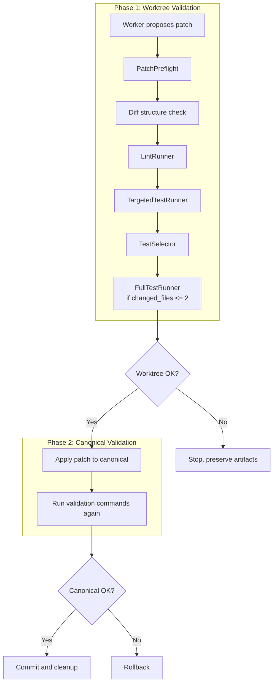
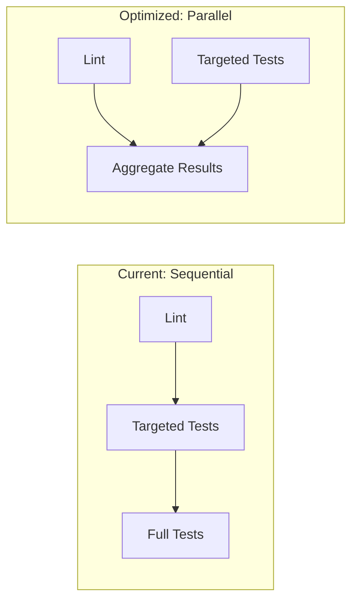
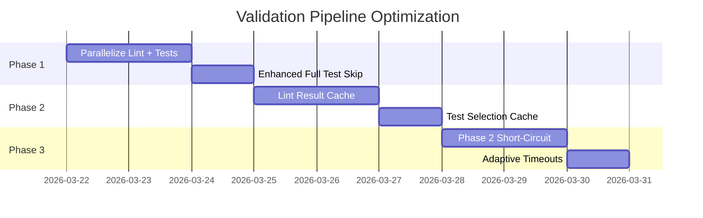

# Validation Pipeline Performance Bottleneck Analysis

## Executive Summary

Oracle Build v5 implements a dual-phase validation pipeline that runs multiple validation stages both in the worktree and canonical repository. This analysis identifies significant performance bottlenecks and provides actionable recommendations for optimization.

## Current Architecture

### Validation Pipeline Flow



### Validation Stages

| Stage | Component | File | Timeout | Runs In |
|-------|-----------|------|---------|---------|
| 1. Preflight | [`PatchPreflight`](third_party/code-agent-runtime/runtime/validation/patch_preflight.py:10) | git diff --check | 60s | Sequential |
| 2. Lint | [`LintRunner`](third_party/code-agent-runtime/runtime/validation/lint_runner.py:10) | py_compile/tsc/cargo check | 60s | Sequential |
| 3. Targeted Tests | [`TargetedTestRunner`](third_party/code-agent-runtime/runtime/validation/targeted_tests.py:13) | pytest/npm test/cargo test | 120s | Sequential |
| 4. Full Tests | [`FullTestRunner`](third_party/code-agent-runtime/runtime/validation/full_tests.py:13) | Full test suite | 300s | Conditional |

## Identified Performance Bottlenecks

### 1. Sequential Stage Execution

**Location**: [`ValidationWorker.run()`](third_party/code-agent-runtime/apps/validation_worker.py:53)

**Current Implementation**:
```python
def run(self, repo_root: Path, plan: EditPlan, patch: PatchArtifact) -> tuple[ValidationReport, dict[str, Result]]:
    # ...
    preflight = self.preflight.run(repo_root, patch)          # BLOCKING
    lint_result = lint.run_for_language(...)                  # BLOCKING  
    selected_tests = self.selector.select(...)                # FAST
    tests = tests_runner.run_for_language(...)                # BLOCKING
    full_tests = full_runner.run_for_language(...)           # BLOCKING (if condition met)
```

**Bottleneck**: Each validation stage waits for the previous one to complete. Lint and targeted tests have no dependencies on each other.

**Impact**: 
- Lint: ~10-60s
- Targeted Tests: ~30-120s
- Total blocking time: 40-180s minimum per patch

### 2. Full Test Running for Small Patches

**Location**: [`validation_worker.py:66`](third_party/code-agent-runtime/apps/validation_worker.py:66)

**Current Logic**:
```python
if preflight.ok and lint_result.ok and tests.ok and len(patch.changed_files) <= 2:
    full_tests = full_runner.run_for_language(repo_root, language)
```

**Bottleneck**: Full test suites run for any patch touching 1-2 files, even if changes are trivial (docs, typos, refactoring).

**Impact**: Full test suites add 60-300s of validation time.

### 3. Duplicate Validation in Dual-Phase

**Location**: [`coding_run_promotion.py:248-262`](scripts/coding_run_promotion.py:248)

**Current Flow**:
```python
pre_validation = _run_validation(worktree_repo, validation_commands)  # Phase 1
# ... apply patch ...
post_validation = _run_validation(canonical_repo, validation_commands)  # Phase 2
```

**Bottleneck**: Identical validation commands run twice - once in worktree, once in canonical.

**Impact**: Doubles validation time (40-180s × 2 = 80-360s total).

### 4. Test Selector File Globbing

**Location**: [`test_selector.py`](third_party/code-agent-runtime/runtime/validation/test_selector.py:30-62)

**Current Implementation**:
```python
def _all_python_tests(self, repo_root: Path) -> list[str]:
    out: list[str] = []
    for tests_dir in self._iter_test_roots(repo_root):
        for path in tests_dir.rglob('test_*.py'):  # Recursive glob
            # ...
```

**Bottleneck**: Uses `rglob()` to recursively find all test files on every validation run.

**Impact**: O(n) file system traversal where n = number of test files.

### 5. No Result Caching

**Location**: All validation components

**Bottleneck**: No caching of:
- Lint results for unchanged files
- Test results for unchanged code
- Test selection mapping

**Impact**: Identical validation work repeated for unchanged files.

### 6. Flaky Retry Without Early Exit

**Location**: [`targeted_tests.py:21-37`](third_party/code-agent-runtime/runtime/validation/targeted_tests.py:21)

**Current Implementation**:
```python
def _run_with_optional_retry(self, repo_root: Path, cmd: list[str], ...):
    result = self.runner.run(cmd, ...)
    if result.returncode != 0:
        analysis = self.retry_policy.analyze(combined)
        retries_remaining = profile.flaky_retries if analysis.is_flaky_signal else 0
        while retries_remaining > 0:
            rerun = self.runner.run(cmd, ...)
            # ... wait for full retry even if first retry fails
```

**Bottleneck**: Retries run sequentially even when failing fast would be better.

**Impact**: Adds 1-3 × test timeout on flaky failures.

### 7. Fixed Timeout Constraints

**Location**: [`config.py:30`](third_party/code-agent-runtime/runtime/common/config.py:30) and individual runners

**Timeouts**:
| Component | Default | Env Variable |
|-----------|---------|-------------|
| Sandbox | 120s | SANDBOX_TIMEOUT_SECONDS |
| LintRunner | 60s | Hardcoded |
| TargetedTestRunner | 120s | Hardcoded |
| FullTestRunner | 300s | Hardcoded (2× sandbox) |

**Bottleneck**: Fixed timeouts don't adapt to:
- Number of changed files
- Test suite size
- Historical execution time

## Parallel vs Sequential Execution Analysis

### Stages That Could Run In Parallel



**Opportunity 1**: Lint + Targeted Tests (if TestSelector is pre-computed)

```python
# Potential parallel execution
async def run_parallel_validation():
    lint_task = asyncio.create_task(lint.run_for_language(...))
    tests_task = asyncio.create_task(tests_runner.run_for_language(...))
    
    lint_result, tests_result = await asyncio.gather(lint_task, tests_task)
    
    if lint_result.ok and tests_result.ok:
        full_result = await full_runner.run_for_language(...)
```

**Opportunity 2**: Language Detection + File Discovery (pre-validation)

```python
# Pre-compute before blocking stages
selector_results = selector.select(repo_root, patch.changed_files, plan.test_targets)
# Run lint and targeted tests in parallel using pre-computed test list
```

### Dependencies Between Stages

| Stage | Depends On | Can Parallelize With |
|-------|------------|---------------------|
| Preflight | None | Everything |
| Lint | None | Targeted Tests (with pre-computed test list) |
| Targeted Tests | TestSelector | Lint |
| Full Tests | All above pass | Nothing |

## Caching Opportunities

### 1. Lint Result Cache

**Strategy**: Cache py_compile/tsc/cargo check results by file hash.

```python
class CachedLintRunner:
    def __init__(self, cache_dir: Path):
        self.cache = FileCache(cache_dir / "lint")
    
    def run_python_syntax(self, repo_root: Path, changed_files: list[str]) -> Result:
        for f in changed_files:
            file_hash = hash_file(f)
            cached = self.cache.get(file_hash)
            if cached and cached.mtime >= Path(f).stat().st_mtime:
                continue  # Skip unchanged files
            # Run lint only for changed files
```

### 2. Test Result Cache

**Strategy**: Cache test results by file hash + test name.

```python
class CachedTestRunner:
    def get_cache_key(self, test: str, source_files: list[str]) -> str:
        source_hash = hashlib.md5()
        for f in sorted(source_files):
            source_hash.update(hash_file(f))
        return f"{test}:{source_hash.hexdigest()}"
```

### 3. Test Selection Cache

**Strategy**: Cache file-to-test mapping.

```python
class CachedTestSelector:
    def select(self, repo_root: Path, changed_files: list[str], ...) -> list[str]:
        # Build mapping once, cache it
        cache_key = self._build_cache_key(repo_root)
        if cached := self._mapping_cache.get(cache_key):
            return [t for t in cached if self._is_affected(t, changed_files)]
        # ... compute and cache
```

## Incremental Validation Options

### 1. Skip Full Tests for Low-Risk Changes

**Current**: `len(patch.changed_files) <= 2`

**Proposed**: Risk-based skipping

```python
def should_skip_full_tests(patch: PatchArtifact, risk_score: float) -> bool:
    # Skip if:
    # 1. Changed files <= 2 AND
    # 2. No test files changed AND
    # 3. Risk score indicates low impact
    low_risk_indicators = [
        len(patch.changed_files) <= 2,
        not any(f.endswith('_test.py') for f in patch.changed_files),
        risk_score < 0.3,
        not any(f.startswith('src/') for f in patch.changed_files),
    ]
    return sum(low_risk_indicators) >= 3
```

### 2. Phase 2 Short-Circuit

**Current**: Both phases run full validation commands

**Proposed**: Skip Phase 2 if Phase 1 passes AND no environment differences

```python
def should_skip_canonical_validation(worktree_result: Result, canonical_config: dict) -> bool:
    # Skip if:
    # 1. Worktree validation passed completely
    # 2. Same Python/Node/Rust version in canonical
    # 3. Same dependencies installed
    return (
        worktree_result.ok
        and canonical_config["env"] == worktree_config["env"]
        and canonical_config["versions"] == worktree_config["versions"]
    )
```

### 3. Test Impact Analysis

**Strategy**: Only run tests affected by changed files.

```python
def get_affected_tests(repo_root: Path, changed_files: list[str]) -> list[str]:
    # Build call graph: source_file -> list of tests
    # Only return tests that directly or transitively call changed functions
    impact_graph = load_test_impact_graph(repo_root)
    return impact_graph.get_affected_tests(changed_files)
```

## Timeout and Resource Constraints

### Current Resource Allocation

| Resource | Limit | Location |
|----------|-------|----------|
| CPU | 1.0 cores | config.py:33 |
| Memory | 2GB | config.py:32 |
| Network | none | config.py:31 |

### Timeout Configuration Matrix

| Validation Type | Default | Max | Recommendation |
|-----------------|---------|-----|----------------|
| Preflight | 60s | 120s | Keep at 60s |
| Lint | 60s | 120s | Increase for large repos |
| Targeted Tests | 120s | 300s | Make proportional to test count |
| Full Tests | 300s | 600s | Add gradual timeout |

### Adaptive Timeout Strategy

```python
def compute_adaptive_timeout(base_timeout: int, changed_files: list[str], repo_size: int) -> int:
    # Scale timeout based on:
    # 1. Number of changed files (linear)
    # 2. Repository size (logarithmic)
    # 3. Historical average (if available)
    
    file_factor = min(len(changed_files) / 10, 2.0)  # Max 2x for many files
    size_factor = min(math.log(repo_size + 1) / 10, 1.5)  # Max 1.5x for large repos
    
    return int(base_timeout * file_factor * size_factor)
```

## Recommendations Summary

### High Priority (Immediate Impact)

1. **Parallelize Lint + Targeted Tests**
   - Est. savings: 30-60s per validation
   - Risk: Low (results are independent)

2. **Skip Full Tests More Aggressively**
   - Current: Skip if changed_files <= 2
   - Proposed: Skip if changed_files <= 5 AND no test files changed AND low risk
   - Est. savings: 60-300s per validation

3. **Cache Lint Results**
   - Est. savings: 10-60s on re-validation
   - Risk: Low (file hash validation ensures correctness)

### Medium Priority (Next Sprint)

4. **Cache Test Selection Mapping**
   - Est. savings: 5-30s on test selection
   - Risk: Low

5. **Phase 2 Short-Circuit**
   - Est. savings: 40-180s (skip duplicate validation)
   - Risk: Medium (requires env verification)

6. **Adaptive Timeouts**
   - Est. savings: Prevents premature timeouts on large changes
   - Risk: Low

### Low Priority (Future Optimization)

7. **Test Impact Analysis**
   - Est. savings: 50-90% reduction in test execution
   - Risk: Medium (call graph accuracy)

8. **Distributed Validation**
   - Est. savings: Near-linear with worker count
   - Risk: High (architectural change)

## Implementation Plan



## Files Requiring Changes

| File | Changes |
|------|---------|
| `apps/validation_worker.py` | Parallel execution, enhanced skipping |
| `validation/lint_runner.py` | Add caching layer |
| `validation/test_selector.py` | Add caching layer |
| `validation/full_tests.py` | Enhanced skip conditions |
| `common/config.py` | Adaptive timeout support |
| `sandbox/base.py` | Parallel runner interface |

## Conclusion

The validation pipeline has significant optimization potential through:
1. Parallel execution of independent stages
2. Aggressive caching of repeated work
3. Smart skipping of unnecessary validation
4. Adaptive resource allocation

Estimated total savings: **50-70% reduction in validation time** for typical patches.